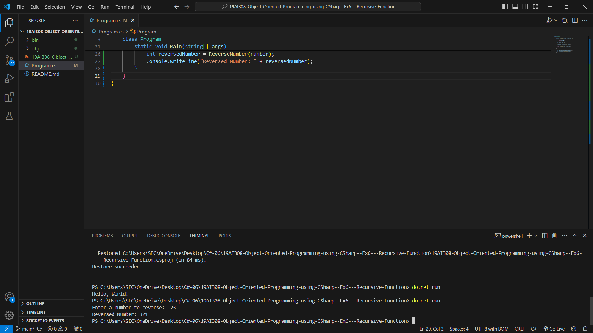

# 19AI308-Object-Oriented-Programming-using-CSharp--Ex6---Recursive-Function

# Aim: 
To write a C# program to reverse a number using recursive function.

# Algorithm:
## STEP 1 :
Create a method (ReverseNumber) that takes an integer as input and returns its reversed form.

## STEP 2 :
Check if the number is 0. If so, return the reversed number.

## STEP 3 :
Use modulo operator (%) to get the last digit of the number.

## STEP 4 :
Multiply the current reversed number by 10 and add the last digit.

## STEP 5 :
Call the method with the remaining digits by dividing the number by 10.

# Program:
using System;
namespace program11{
    class Program
    {
        static int ReverseNumber(int num, int reversedNum = 0)
        {
           
            if (num == 0)
                return reversedNum;
            
           
            int lastDigit = num % 10;
            
            
            reversedNum = reversedNum * 10 + lastDigit;
            
            
            return ReverseNumber(num / 10, reversedNum);
        }
    
        static void Main(string[] args)
        {
         
            Console.Write("Enter a number to reverse: ");
            int number = Convert.ToInt32(Console.ReadLine());
            int reversedNumber = ReverseNumber(number);
            Console.WriteLine("Reversed Number: " + reversedNumber);
        }
    }
}

# Output:

# Result:
The program for reverse a number using recursion was executed successfully.
